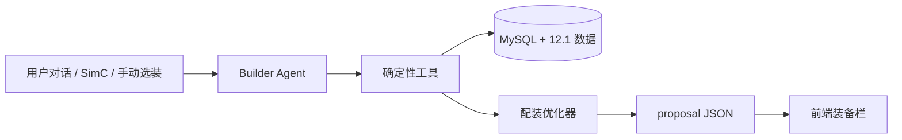

# WoW Gear Agent

魔兽世界 12.1 AI 装备配装助手。项目将版本装备数据、确定性绿字计算器和对话式 Agent 组合起来，为不同职业专精生成可解析、可继续调整的毕业配装方案。

> 当前处于早期开发阶段，数据目标为 12.1 第二赛季；不是 DPS 模拟器。

## 核心原则

- AI 负责理解用户意图、维护会话和解释结果。
- Python 优化器负责装备合法性、属性换算与方案搜索。
- 前端只解析 `proposal` JSON，不从模型文字中提取装备。
- 暴击默认基础值为 5%，精通默认基础值为 8%，再应用专精精通系数。
- 触发型临时绿字不计入静态属性，装备本身的常驻绿字正常计入。



## 已实现

- 40 个职业专精的装备合法性与精通系数。
- 12.1 第二赛季副本、团本、世界首领、地下堡、制造、套装、消耗品与 BIS 数据。
- 334 神话 6/6 掉落装备与 331 制造装备候选池。
- 地下堡英雄 6/6（321）装备，包含商人和宝箱来源。
- 潮缚石窟 13 件世界首领装备，包含英雄与神话属性变体；交叉掉落保留各自来源类型。
- 绿字比例和面板百分比两类目标。
- 四件套后置催化标记，保留原装备属性、来源与特效。
- 默认优先尾王特效装备；默认目标两件制造装备，制造武器也计入总数，未指定部位时优先小部位。
- 自动识别保留现有装备并补齐空位的需求，支持排除团本、世界首领等来源类型。
- 固定专精 BIS 饰品、自动合剂、手动宝石接口。
- AgentScope + DeepSeek 对话式 Builder Agent。
- FastAPI 会话、对话、状态更新和结构化提案接口；独立上下文、自动压缩与 MySQL 会话持久化。

## 技术栈

- Python 3.12
- FastAPI
- AgentScope
- DeepSeek OpenAI-compatible API
- SQLAlchemy + MySQL
- Alembic
- Pydantic

## 本地启动

建议在独立虚拟环境中运行：

```bash
python3 -m venv .venv
source .venv/bin/activate
pip install -r requirements.txt
cp .env.example .env
```

在 `.env` 中填写本机配置。`.env` 已被 Git 忽略，不要提交真实 API Key 或数据库密码。

初始化数据库后启动 API：

```bash
PYTHONPATH=. alembic upgrade head
PYTHONPATH=. python scripts/import_data.py
PYTHONPATH=. uvicorn backend.main:app --reload --port 8008
```

- Swagger UI: <http://127.0.0.1:8008/docs>
- 健康检查: <http://127.0.0.1:8008/health>

启动前端：

```bash
cd frontend
npm install
npm run dev
```

- Web UI: <http://127.0.0.1:5173/builder>

## Builder API

```text
POST   /api/v1/builder/sessions
GET    /api/v1/builder/sessions/{session_id}
GET    /api/v1/builder/sessions/{session_id}/stats
PATCH  /api/v1/builder/sessions/{session_id}
POST   /api/v1/builder/sessions/{session_id}/messages
POST   /api/v1/builder/sessions/{session_id}/messages/stream
DELETE /api/v1/builder/sessions/{session_id}
POST   /api/v1/loadouts
GET    /api/v1/loadouts?creator_name={name}
GET    /api/v1/loadouts/{loadout_id}
PATCH  /api/v1/loadouts/{loadout_id}
DELETE /api/v1/loadouts/{loadout_id}
POST   /api/v1/loadouts/{loadout_id}/open
GET    /api/v1/catalog/specs
GET    /api/v1/loot/instances
GET    /api/v1/loot/items
```

创建奶骑会话：

```json
{"spec":"paladin.holy"}
```

发送配装要求：

```json
{
  "message": "面板急速约30%、暴击约20%、全能约15%，精通尽量低，生成完整毕业配装"
}
```

前端使用：

```text
response.proposal.solutions[0].equipment
```

`message` 只用于展示；`proposal` 才是程序使用的权威数据。

流式接口使用 SSE，按顺序返回 `status`、`tool_start`、`tool_result`、
`text_delta`、`proposal`、`state`、`done`；异常返回 `error`。前端逐段展示
流程状态，最终展示 `done.message`，避免把中间工具搜索文字当作最终答复；收到
完整的 `proposal` 事件后展示可选方案。

保存当前 Builder 方案：

```json
{
  "name": "奶骑团本毕业装",
  "creator_name": "Lrx",
  "builder_session_id": "..."
}
```

`POST /loadouts/{id}/open` 会从数据库快照创建新的 Builder 会话。之后继续调用
`/messages` 或 `/messages/stream`，Agent 会读取恢复后的装备、目标和限制。工作台
修改不会自动覆盖原方案；用 `PATCH /loadouts/{id}` 保存更改，用 `POST /loadouts`
另存为新方案。

## 测试

```bash
PYTHONPATH=. PYTEST_DISABLE_PLUGIN_AUTOLOAD=1 pytest -q
PYTHONPATH=. python scripts/audit_all_specs.py
```

当前基础测试为 59 项（部分用例需要可连接的 MySQL），另有 40 专精批量配装审计脚本。

## Docker 手动部署与更新

生产环境由 `compose.yaml` 启动 MySQL、FastAPI 和 Nginx。以下以服务器仓库
`/opt/wow-app`、分支 `develop` 为例；所有命令都在同一个仓库目录执行，不依赖 Jenkins。

### 环境配置

Docker Compose 默认读取仓库目录下的 `.env`，不要求存在 `.env.production`。
首次部署复制 `.env.example` 为 `.env`，填写真实配置；已有数据库必须沿用原来的
数据库名、用户名和密码，不要重新生成密码。`.env` 不会提交到 Git 或复制进镜像。
如果已经使用其他环境文件，在每条 `docker compose` 命令中增加
`--env-file /实际存在的文件路径`，不要使用不存在的路径。

首次部署：

```bash
cd /opt/wow-app
docker compose build backend frontend
docker compose up -d --wait mysql
docker compose run --rm --no-deps backend alembic upgrade head
docker compose run --rm --no-deps backend python scripts/import_data.py
docker compose up -d --no-deps backend frontend
```

### 更新已有服务

仅后端或装备数据有变化时：

```bash
cd /opt/wow-app
git pull --ff-only origin develop
docker compose build backend
docker compose run --rm --no-deps backend alembic upgrade head
docker compose run --rm --no-deps backend python scripts/import_data.py
docker compose up -d --no-deps backend
docker compose ps
docker compose logs --tail=100 backend
```

如果前端也有变化，把构建与启动两条命令改为：

```bash
docker compose build backend frontend
docker compose up -d --no-deps backend frontend
```

拉取 Git 或构建镜像不会自动更新数据库：仓库包含 `data/` 装备 JSON 和
`scripts/import_data.py`，必须执行导入命令才能更新数据库里的装备。
导入会新增或更新目录数据，不清空已有对话和配装方案；Alembic 负责数据库结构迁移。
`--no-deps` 避免更新应用时重建 MySQL。不要执行 `docker compose down -v`，它会删除数据库卷。
无需停止 MySQL，也无需重新运行联网抓取装备的脚本；提交的 JSON 已包含更新后的数据。

若拉取提示本地 `Dockerfile` 或 `compose.yaml` 有冲突，先备份并检查本地修改，
不要用 `git reset --hard` 覆盖服务器配置。

仓库保留 `Jenkinsfile` 供可选流水线使用，手动部署不需要它。

## 当前限制

- 运行中的 Agent 使用进程内缓存，已持久化的对话与状态可在服务重启后从 MySQL 恢复；运行中请求会被重启中断。
- 当前是可信小团队共享方案库，`creator_name` 只用于标记和筛选，不提供权限隔离。
- SimC 导入接口尚未完成。
- 宝石由用户选择，不自动填充。
- 当前装备源尚未包含精确护甲值，前端会明确显示“待补齐”，不会估算。
- 未实现 DPS 模拟；属性目标完全来自用户或后续维护的数据源。

## 安全

- 所有密钥和数据库凭据只从环境变量读取。
- 仓库只提交 `.env.example`，不提交 `.env`。
- 提交前应运行敏感信息扫描。

## 免责声明

本项目为非官方社区工具，与 Blizzard Entertainment 无隶属或背书关系。World of Warcraft 及相关名称与素材归其权利人所有。
