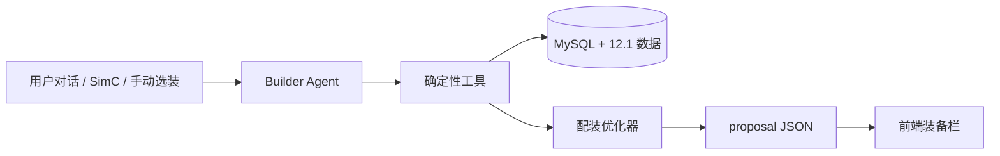

# WoW Gear Agent

魔兽世界 12.1 AI 装备配装助手。项目将版本装备数据、确定性绿字计算器和对话式 Agent 组合起来，为不同职业专精生成可解析、可继续调整的毕业配装方案。

> 当前处于早期开发阶段，数据目标为 12.1 第二赛季；不是 DPS 模拟器。

## 核心原则

- AI 负责理解用户意图、维护会话和解释结果。
- Python 优化器负责装备合法性、属性换算与方案搜索。
- 前端只解析 `proposal` JSON，不从模型文字中提取装备。
- 暴击默认基础值为 5%，精通默认基础值为 8%，再应用专精精通系数。
- 触发型临时绿字不计入静态属性，装备本身的常驻绿字正常计入。



## 已实现

- 40 个职业专精的装备合法性与精通系数。
- 12.1 第二赛季副本、团本、制造、套装、消耗品与 BIS 数据。
- 334 神话 6/6 掉落装备与 331 制造装备候选池。
- 绿字比例和面板百分比两类目标。
- 四件套后置催化标记，保留原装备属性、来源与特效。
- 尾王特效装备优先、制造装备递增代价。
- 固定专精 BIS 饰品、自动合剂、手动宝石接口。
- AgentScope + DeepSeek 对话式 Builder Agent。
- FastAPI 会话、对话、状态更新和结构化提案接口。

## 技术栈

- Python 3.12
- FastAPI
- AgentScope
- DeepSeek OpenAI-compatible API
- SQLAlchemy + MySQL
- Alembic
- Pydantic

## 本地启动

建议在独立虚拟环境中运行：

```bash
python3 -m venv .venv
source .venv/bin/activate
pip install -r requirements.txt
cp .env.example .env
```

在 `.env` 中填写本机配置。`.env` 已被 Git 忽略，不要提交真实 API Key 或数据库密码。

初始化数据库后启动 API：

```bash
PYTHONPATH=. alembic upgrade head
PYTHONPATH=. python scripts/import_data.py
PYTHONPATH=. uvicorn backend.main:app --reload --port 8008
```

- Swagger UI: <http://127.0.0.1:8008/docs>
- 健康检查: <http://127.0.0.1:8008/health>

## Builder API

```text
POST   /api/v1/builder/sessions
GET    /api/v1/builder/sessions/{session_id}
PATCH  /api/v1/builder/sessions/{session_id}
POST   /api/v1/builder/sessions/{session_id}/messages
DELETE /api/v1/builder/sessions/{session_id}
```

创建奶骑会话：

```json
{"spec":"paladin.holy"}
```

发送配装要求：

```json
{
  "message": "面板急速约30%、暴击约20%、全能约15%，精通尽量低，生成完整毕业配装"
}
```

前端使用：

```text
response.proposal.solutions[0].equipment
```

`message` 只用于展示；`proposal` 才是程序使用的权威数据。

## 测试

```bash
PYTHONPATH=. PYTEST_DISABLE_PLUGIN_AUTOLOAD=1 pytest -q
PYTHONPATH=. python scripts/audit_all_specs.py
```

当前基础测试为 19 项，另有 40 专精批量配装审计脚本。

## 当前限制

- FastAPI Builder 会话暂存在进程内存中，服务重启后清空。
- 用户注册、登录和已保存配装尚未接入接口。
- SimC 导入接口尚未完成。
- 宝石由用户选择，不自动填充。
- 未实现 DPS 模拟；属性目标完全来自用户或后续维护的数据源。

## 安全

- 所有密钥和数据库凭据只从环境变量读取。
- 仓库只提交 `.env.example`，不提交 `.env`。
- 提交前应运行敏感信息扫描。

## 免责声明

本项目为非官方社区工具，与 Blizzard Entertainment 无隶属或背书关系。World of Warcraft 及相关名称与素材归其权利人所有。
